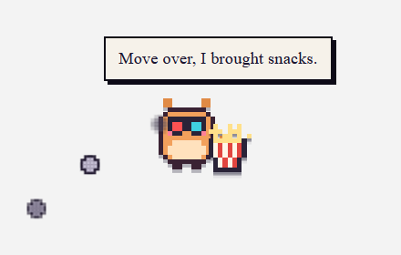
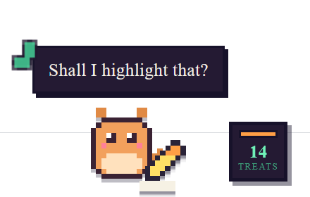
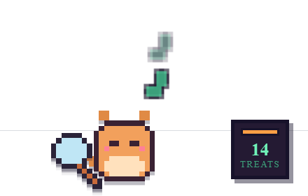

# Ruckus

<p align="center">
  
  
  
</p>
**Your browser's mischievous sidekick.**

A pixel creature that lives in your browser. It wanders your pages, naps, chases
bugs, and now and then pinches a word out of a paragraph and runs off with it.
Everything it takes, it gives back.

It is also a prettier `Ctrl+F`, an offline PDF and Word toolkit, a place to bury
pages for later, and a clipboard that remembers.

**No accounts. No servers. No analytics. The extension contains no network code
at all.**

[](LICENSE)

<p align="center">
  
</p>

## Install

### [➜ Get it for Firefox](https://addons.mozilla.org/firefox/addon/lingo-loco/)
### [➜ Get it for Chrome](https://chromewebstore.google.com/)

## Layout

```
Chrome/ , Firefox/          complete copies of the addon, one per store
  manifest.json
  background.js             state, alarms, reminders, context menus
  core/                     config.js, lines.js, sprites.js
  content/                  what runs on every page
    mischief/               one file per prank
    quirks/                 one file per self-directed behaviour
  ui/                       in-page stylesheets, split by concern
  popup/                    the toolbar popup, Pet tab and Toolkit tab
  tools/                    the offline document suite
    ops/                    one file per operation
  vendor/                   bundled libraries, unmodified
  icons/ , sounds/
docs/screenshots/           images used above
```

## Where to change things

| I want to… | Edit |
| --- | --- |
| something it says | `core/lines.js` — **all** dialogue, nothing else has text |
| how often it does something | `core/config.js` — every weight and timing |
| add a prank | new file in `content/mischief/` + a manifest line |
| add a behaviour | new file in `content/quirks/` + a manifest line |
| add a document operation | new file in `tools/ops/` + a `<script>` line |
| the look | `ui/*.css`, `popup/*.css`, `tools/*.css` |

### Adding a prank

```js
RKRegistry.trick({
  id: 'tilt',                       // must match the filename
  weight: 3,                        // config.js can override
  plan: function (kit) {
    return kit.styleTrick('tilt', function (el) {
      el.style.transform += ' rotate(6deg)';
    }, 'mischief.tilt');            // a path into lines.js
  }
});
```

Every trick **must undo itself exactly**. Originals are hidden, never removed,
and each change records how to reverse it.

## What it does

**Finds things.** `Ctrl+Shift+F` opens a finder with match counts, whole-word and
regex options, and a strip down the edge showing where every match sits. Ruckus
trots over to each one.

**Handles documents, offline.** Merge, split, rotate and number PDFs. Images to
PDF or Word. PDF to images or text. Word to PDF or HTML. Fourteen operations,
all running in your own browser. Nothing is uploaded, and it works with the
network switched off.

**Keeps things.** Bury a page for later; anything you copy is remembered. Both
live in the burrow, one click away.

**Small useful things.** Snip an area to a PNG. Copy a link that jumps to the
text you selected. Reader mode. Water and movement reminders, and a pomodoro
timer.

**Notices what you are doing.** Typing? It sits beside your text box with a
notebook. Watching a video? 3D glasses and popcorn. On a password field it puts
on a blindfold and turns its back.

## Interacting with it

| Action | How |
| --- | --- |
| Pat | Click |
| Menu | Long press, or right click the page → Ruckus |
| Shoo | Double click |
| Carry | Drag |
| Feed | Drag a treat from the jar onto its head |
| Find on page | `Ctrl+Shift+F` |
| Hide it | `Alt+Shift+P` |

Moving the mouse near it does nothing — every interaction is deliberate, so you
cannot dismiss it by accident.

## Privacy

[PRIVACY.md](PRIVACY.md). Short version: everything is stored locally, the
extension has no network code, and the two features that touch your content —
clipboard history and per-site visit counts — are disclosed in the interface and
can be switched off and wiped.

## Third-party code

[THIRD-PARTY.md](THIRD-PARTY.md). Four libraries, bundled unmodified in
`vendor/`: pdf-lib (MIT), pdf.js (Apache-2.0), mammoth (BSD-2-Clause) and docx
(MIT). [REVIEWER-NOTES.md](REVIEWER-NOTES.md) lists their SHA-256 hashes and how
to reproduce them.

## Licence

MIT. See [LICENSE](LICENSE).
